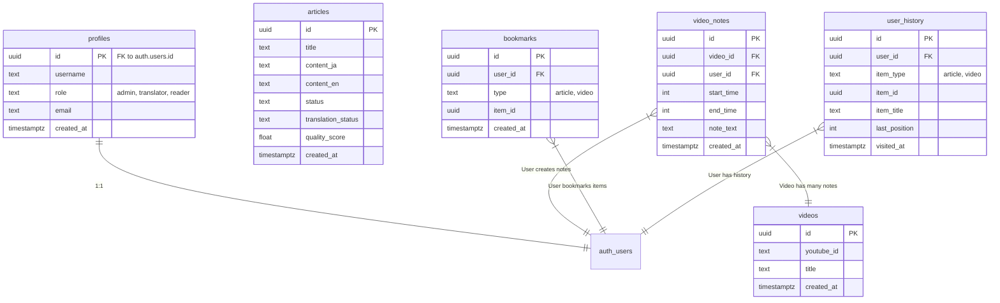

# Database Schema

## Tables

### `profiles`

Stores user profile information, linked to `auth.users`.

- `id` (uuid, PK, FK to auth.users.id)
- `username` (text)
- `role` (text: 'admin', 'translator', 'reader')
- `email` (text) - _Note: Sometimes synced from auth_
- `created_at` (timestamptz)

### `articles`

Stores content for translation.

- `id` (uuid, PK)
- `title` (text)
- `content_ja` (text) - Original Japanese content
- `content_en` (text) - English translation
- `status` (text)
- `translation_status` (text: 'pending', 'review', 'published')
- `quality_score` (float)
- `created_at` (timestamptz)

### `videos`

Stores YouTube video metadata.

- `id` (uuid, PK)
- `youtube_id` (text)
- `title` (text)
- `created_at` (timestamptz)

### `video_notes`

Timestamped notes on videos.

- `id` (uuid, PK)
- `video_id` (uuid, FK to videos.id)
- `user_id` (uuid, FK to auth.users.id)
- `start_time` (int)
- `end_time` (int)
- `note_text` (text)
- `created_at` (timestamptz)

### `bookmarks`

User bookmarks for articles or videos.

- `id` (uuid, PK)
- `user_id` (uuid, FK to auth.users.id)
- `type` (text: 'article', 'video')
- `item_id` (uuid)
- `created_at` (timestamptz)

### `user_history` (New)

Tracks user activity.

- `id` (uuid, PK)
- `user_id` (uuid, FK to auth.users.id)
- `item_type` (text: 'article', 'video')
- `item_id` (uuid)
- `item_title` (text)
- `last_position` (int)
- `visited_at` (timestamptz)

## Relationships

- `profiles.id` -> `auth.users.id`
- `user_history.user_id` -> `auth.users.id`

## Diagram

