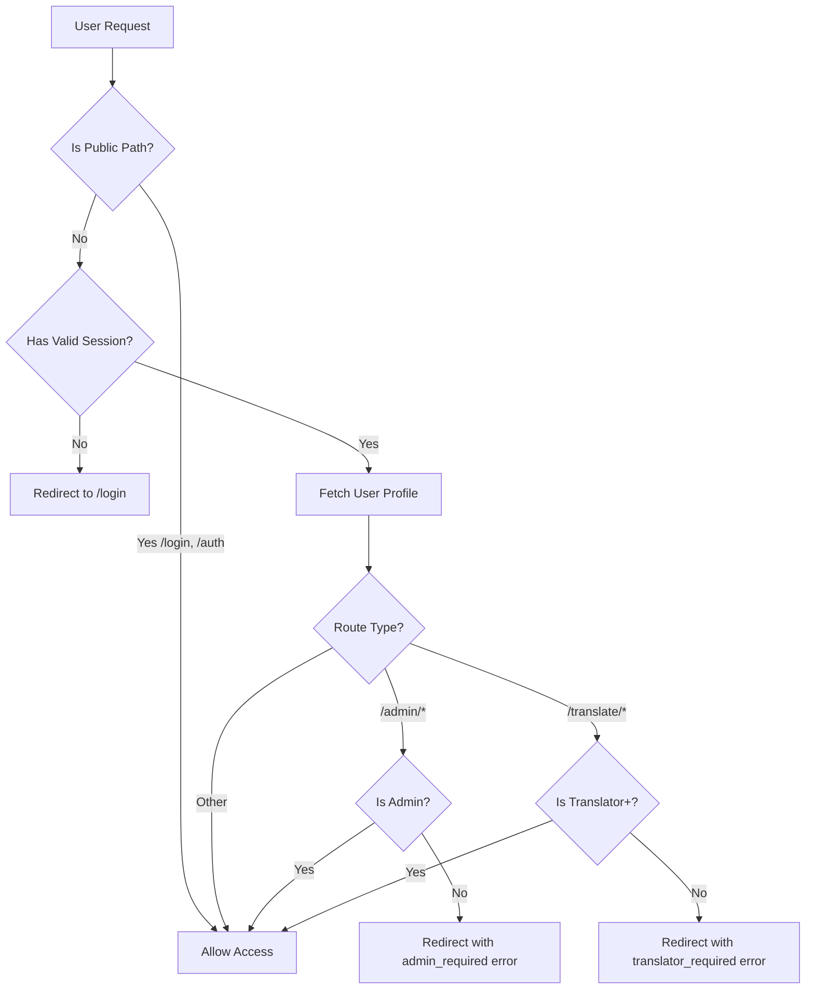
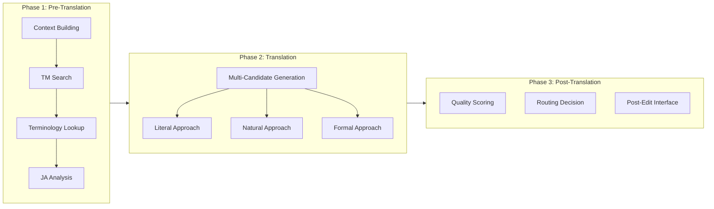
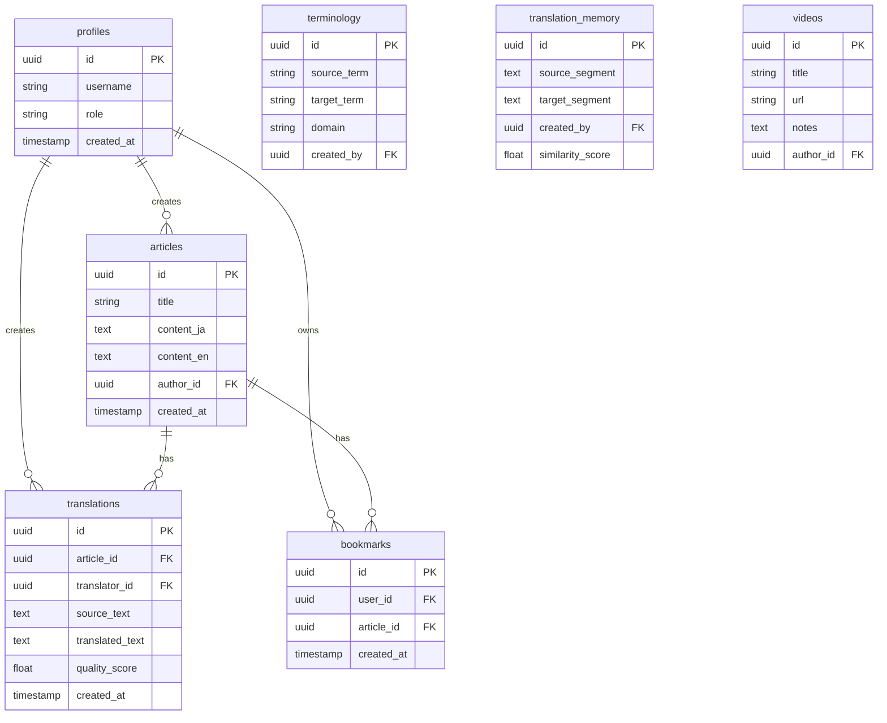

# System Implementation Report

**Generated**: January 19, 2026  
**Version**: 2.0 (Comprehensive)  
**Status**: Production Verified  

---

## Table of Contents

1. [Codebase Overview](#1-codebase-overview)
2. [Directory Structure](#2-directory-structure)
3. [File Inventory](#3-file-inventory)
4. [Authentication & Authorization Flow](#4-authentication--authorization-flow)
5. [MAC-RAG Translation Pipeline](#5-mac-rag-translation-pipeline)
6. [User Roles & Permissions](#6-user-roles--permissions)
7. [API Reference](#7-api-reference)
8. [Database Schema](#8-database-schema)
9. [Deprecated & Irrelevant Files](#9-deprecated--irrelevant-files)
10. [Deployment Configuration](#10-deployment-configuration)

---

## 1. Codebase Overview

| Metric | Value |
|--------|-------|
| **Total Source Files** | 106 |
| **API Route Groups** | 15 |
| **UI Components** | 15 |
| **Library Modules** | 9 |
| **Utility Scripts** | 16 |
| **Framework** | Next.js 15.1 (App Router) |
| **Backend** | Supabase (Auth + Postgres) |
| **AI Integration** | OpenRouter API |

---

## 2. Directory Structure

```
packages/web/
├── app/                          # Next.js App Router
│   ├── api/                      # Backend API routes (15 groups)
│   │   ├── admin/               # Admin-only routes
│   │   ├── auth/                # Authentication (login, logout, me, signup)
│   │   ├── translate/           # Translation endpoints
│   │   └── ...                  # Other feature APIs
│   ├── admin/                   # Admin dashboard page
│   ├── articles/                # Article viewing/editing
│   ├── dashboard/               # Main dashboard
│   ├── login/                   # Login page
│   ├── translate/               # Translation workspace
│   │   └── mac-rag/             # MAC-RAG translation UI
│   ├── videos/                  # Video content pages
│   └── layout.tsx               # Root layout with auth header
│
├── components/                   # Reusable UI components
│   ├── AuthHeader.tsx           # Login state, role badges
│   ├── RoleBasedNavigation.tsx  # Dynamic nav based on role
│   ├── TranslationEditor.tsx    # Main translation UI
│   ├── VideoPlayer.tsx          # Video playback
│   └── translation/             # Translation-specific components
│       ├── ContextBuilderPanel.tsx
│       ├── PostTranslationPanel.tsx
│       ├── QualityScoreDisplay.tsx
│       ├── TranslationCandidates.tsx
│       └── TranslationOutput.tsx
│
├── lib/                         # Core business logic
│   ├── supabase/                # Database clients
│   │   ├── client.ts            # Browser client
│   │   ├── server.ts            # SSR client + Admin client
│   │   └── middleware.ts        # Auth middleware logic
│   ├── agents/                  # AI translation agents
│   │   ├── ja-en-agent.ts       # Japanese→English handler
│   │   ├── ja-en-specialist.ts  # Advanced translation
│   │   └── prompts.ts           # LLM prompt templates
│   ├── context/                 # Context processing
│   │   ├── analyzers.ts         # Text analysis
│   │   ├── context-builder.ts   # Context assembly
│   │   ├── context-pairer.ts    # Parallel text pairing
│   │   └── gap-detector.ts      # Missing content detection
│   ├── llm/                     # LLM integration
│   │   ├── provider.ts          # OpenRouter client
│   │   └── agent-logger.ts      # Conversation logging
│   ├── quality/                 # Translation quality
│   │   ├── scorer.ts            # LLM-assisted scoring
│   │   └── routing.ts           # Post-edit routing
│   └── retrieval/               # Data retrieval
│       ├── terminology.ts       # Term lookup
│       └── tm-search.ts         # Translation memory
│
├── scripts/                     # Utility scripts (16 files)
│   ├── check-and-fix-profiles.js
│   ├── create-test-profiles.js
│   ├── fix-rls.js
│   ├── test-logins.js
│   └── ...
│
├── middleware.ts                # Global middleware entry
└── types/                       # TypeScript definitions
```

---

## 3. File Inventory

### A. API Routes (26 endpoints)

| Route | Method | Purpose | Auth Required | Role Required |
|-------|--------|---------|---------------|---------------|
| `/api/auth/login` | POST | User authentication | No | - |
| `/api/auth/logout` | POST | Session termination | Yes | Any |
| `/api/auth/signup` | POST | User registration | No | - |
| `/api/auth/me` | GET | Current user info | Yes | Any |
| `/api/admin/users` | GET | List all users | Yes | Admin |
| `/api/admin/update-role` | POST | Change user role | Yes | Admin |
| `/api/articles` | GET | List articles | Yes | Any |
| `/api/articles/[id]` | GET | Article detail | Yes | Any |
| `/api/articles/[id]/translate` | POST | Translate article | Yes | Translator+ |
| `/api/translate/mac-rag` | POST | Full MAC-RAG pipeline | Yes | Translator+ |
| `/api/translate/suggest` | POST | Quick translation | Yes | Translator+ |
| `/api/terminology` | GET/POST | Terminology CRUD | Yes | Any |
| `/api/terminology/import` | POST | Bulk term import | Yes | Translator+ |
| `/api/tm/search` | POST | Translation memory search | Yes | Translator+ |
| `/api/videos` | GET/POST | Video CRUD | Yes | Any |
| `/api/video-notes` | GET/POST | Video annotations | Yes | Any |
| `/api/bookmarks` | GET/POST/DELETE | User bookmarks | Yes | Any |
| `/api/context/retrieve` | POST | Context retrieval | Yes | Translator+ |
| `/api/agent/config` | GET/POST | Agent settings | Yes | Admin |
| `/api/agent/logs` | GET | Conversation logs | Yes | Admin |
| `/api/debug/db` | GET | Database debug | Yes | Admin |
| `/api/debug/migrate` | POST | Run migrations | Yes | Admin |
| `/api/debug/reset-passwords` | POST | Reset test passwords | Yes | Admin |

### B. UI Components (15 files)

| Component | Lines | Purpose |
|-----------|-------|---------|
| `TranslationEditor.tsx` | 850+ | Main translation workspace |
| `ContextBuilderPanel.tsx` | 500+ | Pre-translation context building |
| `PostTranslationPanel.tsx` | 530+ | Post-edit quality review |
| `TranslationCandidates.tsx` | 430+ | Multi-candidate display |
| `AgentConfigPanel.tsx` | 470+ | AI agent configuration |
| `AgentConversationLog.tsx` | 370+ | AI conversation viewer |
| `RoleBasedNavigation.tsx` | 154 | Dynamic navigation |
| `AuthHeader.tsx` | 115 | Authentication header |
| `VideoPlayer.tsx` | 200+ | Video playback |
| `QualityScoreDisplay.tsx` | 260+ | Quality metrics visualization |

### C. Library Modules (14 files)

| Module | Lines | Purpose |
|--------|-------|---------|
| `ja-en-agent.ts` | 319 | JA→EN translation logic |
| `ja-en-specialist.ts` | 420+ | Advanced JA handling |
| `analyzers.ts` | 450+ | Text analysis |
| `context-pairer.ts` | 340+ | Parallel text pairing |
| `gap-detector.ts` | 320+ | Coverage analysis |
| `terminology.ts` | 360+ | Term extraction |
| `tm-search.ts` | 240+ | TM matching |
| `scorer.ts` | 227 | Quality scoring |
| `provider.ts` | 260+ | OpenRouter LLM client |

---

## 4. Authentication & Authorization Flow

### Process Flow Diagram



### Middleware Implementation

**File**: `lib/supabase/middleware.ts` (101 lines)

```typescript
// Key logic sections:

// 1. Public path whitelist (lines 40-42)
const publicPaths = ['/login', '/auth', '/api/auth']
const isPublicPath = publicPaths.some(path => pathname.startsWith(path))

// 2. Authentication check (lines 45-50)
if (!user && !isPublicPath) {
    return NextResponse.redirect('/login?redirectTo=' + pathname)
}

// 3. Role-based access control (lines 64-83)
if (isAdminOnly && userRole !== 'admin') {
    return NextResponse.redirect('/login?error=admin_required')
}
if (isTranslatorRequired && userRole === 'reader') {
    return NextResponse.redirect('/login?error=translator_required')
}
```

### Supabase Clients

| Client | File | Key | Use Case |
|--------|------|-----|----------|
| `createClient()` | `server.ts` | Anon Key | Standard user operations (RLS enforced) |
| `createAdminClient()` | `server.ts` | Service Role Key | Admin operations (bypass RLS) |
| `createBrowserClient()` | `client.ts` | Anon Key | Client-side operations |

---

## 5. MAC-RAG Translation Pipeline

### Pipeline Architecture



### Phase Details

#### Phase 1: Pre-Translation

| Component | File | Function |
|-----------|------|----------|
| Context Builder | `context-builder.ts` | Assembles surrounding sentences |
| Context Pairer | `context-pairer.ts` | Creates JA↔EN parallel pairs |
| Gap Detector | `gap-detector.ts` | Identifies untranslated segments |
| TM Search | `tm-search.ts` | Fuzzy matching against translation memory |
| Terminology | `terminology.ts` | Domain term extraction and lookup |
| JA Analyzer | `ja-en-agent.ts` | Japanese linguistic analysis |

#### Phase 2: Translation

**Multi-candidate generation using 3 approaches:**

| Approach | Description | Temperature |
|----------|-------------|-------------|
| Literal | Word-for-word accuracy | 0.3 |
| Natural | Native speaker fluency | 0.7 |
| Formal | Academic/professional style | 0.5 |

#### Phase 3: Post-Translation

**Quality Scoring Dimensions:**

| Dimension | Weight | Criteria |
|-----------|--------|----------|
| Adequacy | 35% | Meaning preservation |
| Fluency | 30% | Natural readability |
| Terminology | 20% | Correct term usage |
| Style | 15% | Register appropriateness |

**Routing Thresholds:**

| Overall Score | Routing | Action |
|---------------|---------|--------|
| ≥ 90% | Auto Accept | No human review |
| 85-89% | Light PE | Quick review |
| 70-84% | Standard PE | Full review |
| < 70% | Full Revision | Retranslate |

### Japanese-Specific Handling

**File**: `ja-en-agent.ts` (319 lines)

| Feature | Implementation |
|---------|----------------|
| **Subject Inference** | Pattern matching on verb forms (くれる→"someone to me/us") |
| **Keigo Detection** | Sonkeigo, kenjougo, teineigo level analysis |
| **Structure Transform** | SOV→SVO sentence restructuring guidance |
| **Onomatopoeia** | Kendo-specific sound translations (ドン→"with a thud") |

---

## 6. User Roles & Permissions

### Role Hierarchy

```
Admin (Full Access)
  │
  ├── Translator (Content Creation)
  │     │
  │     └── Reader (Content Consumption)
```

### Permission Matrix

| Feature/Route | Reader | Translator | Admin |
|---------------|:------:|:----------:|:-----:|
| **Content Access** |
| View Dashboard | ✅ | ✅ | ✅ |
| View Articles | ✅ | ✅ | ✅ |
| View Videos | ✅ | ✅ | ✅ |
| View Terminology | ✅ | ✅ | ✅ |
| Manage Bookmarks | ✅ | ✅ | ✅ |
| **Translation** |
| Access /translate | ❌ | ✅ | ✅ |
| Use MAC-RAG | ❌ | ✅ | ✅ |
| Create Translations | ❌ | ✅ | ✅ |
| Import Terminology | ❌ | ✅ | ✅ |
| **Administration** |
| Access /admin | ❌ | ❌ | ✅ |
| View User List | ❌ | ❌ | ✅ |
| Change User Roles | ❌ | ❌ | ✅ |
| View System Stats | ❌ | ❌ | ✅ |
| Agent Configuration | ❌ | ❌ | ✅ |
| Debug Tools | ❌ | ❌ | ✅ |

### Navigation Items by Role

| NavItem | Reader | Translator | Admin |
|---------|:------:|:----------:|:-----:|
| Dashboard | ✅ | ✅ | ✅ |
| Articles | ✅ | ✅ | ✅ |
| Videos | ✅ | ✅ | ✅ |
| Terminology | ✅ | ✅ | ✅ |
| Bookmarks | ✅ | ✅ | ✅ |
| Translate | ❌ | ✅ | ✅ |
| 🔬 MAC-RAG | ❌ | ✅ | ✅ |
| Admin | ❌ | ❌ | ✅ |

---

## 7. API Reference

### Authentication APIs

#### POST `/api/auth/login`
```typescript
// Request
{ email: string, password: string }

// Response (200)
{ success: true }

// Response (400)
{ error: "Invalid login credentials" }
```

#### GET `/api/auth/me`
```typescript
// Response (200)
{
  user: { id: string, email: string },
  profile: { id: string, username: string, role: "admin" | "translator" | "reader" }
}
```

### Translation APIs

#### POST `/api/translate/mac-rag`
```typescript
// Request
{
  sourceText: string,
  sourceLang?: "ja" | "en",
  targetLang?: "ja" | "en",
  phase?: "context" | "translate" | "score" | "full",
  approaches?: ("literal" | "natural" | "formal")[],
  articleId?: string,
  videoId?: string
}

// Response
{
  phase: string,
  context?: { ... },
  tmMatches?: TMMatch[],
  terminology?: TerminologyConstraints,
  candidates?: TranslationCandidate[],
  qualityAssessment?: QualityAssessment,
  timings?: Record<string, number>
}
```

### Admin APIs

#### GET `/api/admin/users`
```typescript
// Response (200)
{
  users: Array<{
    id: string,
    email: string,
    role: "admin" | "translator" | "reader",
    created_at: string
  }>
}
```

#### POST `/api/admin/update-role`
```typescript
// Request
{ userId: string, role: "admin" | "translator" | "reader" }

// Response (200)
{ success: true }
```

---

## 8. Database Schema

### Core Tables



---

## 9. Deprecated & Irrelevant Files

### Root-Level Files (Candidates for Removal)

| File | Size | Reason |
|------|------|--------|
| `message_draft.md` | 35KB | Temporary planning document |
| `message_draft_2.md` | 16KB | Superseded by message_draft.md |
| `message_draft_3.md` | 17KB | Superseded by message_draft.md |
| `+ Polish the @project_description.md` | 2.5KB | Invalid filename, temp note |
| `- Documentation guideline.yaml` | 259B | Invalid filename, temp note |

### Duplicate Scripts in `packages/web/`

| File | Duplicate Of | Action |
|------|--------------|--------|
| `check_users.js` | `scripts/list-users.js` | Remove root file |
| `list_users.js` | `scripts/list-users.js` | Remove root file |
| `reset_password.js` | `reset_all_passwords.js` | Consolidate |

### Redundant Scripts in `packages/web/scripts/`

| File | Reason |
|------|--------|
| `setup_test_user.js` | Superseded by `setup-test-users.js` |
| `fix-rls.js` | One-time migration, keep for reference |
| `cleanup-rls-policies.js` | One-time migration |

### Recommendation

```bash
# Safe to delete (temporary/draft files)
rm message_draft.md message_draft_2.md message_draft_3.md
rm "- Documentation guideline.yaml" "+ Polish the @project_description.md"
rm packages/web/check_users.js packages/web/list_users.js

# Move to archive/ (one-time scripts, keep for reference)
mkdir -p packages/web/scripts/archive
mv packages/web/scripts/fix-rls.js packages/web/scripts/archive/
mv packages/web/scripts/cleanup-rls-policies.js packages/web/scripts/archive/
```

---

## 10. Deployment Configuration

### Render.yaml

```yaml
services:
  - type: web
    name: kendo-translation
    runtime: node
    buildCommand: npm install && npm run build
    startCommand: npm run start
    envVars:
      - key: NEXT_PUBLIC_SUPABASE_URL
        sync: false
      - key: NEXT_PUBLIC_SUPABASE_ANON_KEY
        sync: false
      - key: SUPABASE_SERVICE_ROLE_KEY
        sync: false
      - key: OPENROUTER_API_KEY
        sync: false
```

### Required Environment Variables

| Variable | Purpose | Where to Set |
|----------|---------|--------------|
| `NEXT_PUBLIC_SUPABASE_URL` | Supabase project URL | Render Dashboard |
| `NEXT_PUBLIC_SUPABASE_ANON_KEY` | Public/anon key | Render Dashboard |
| `SUPABASE_SERVICE_ROLE_KEY` | Admin operations | Render Dashboard (SECRET) |
| `OPENROUTER_API_KEY` | AI translation | Render Dashboard (SECRET) |

### Production URLs

| Service | URL |
|---------|-----|
| Web App | https://kendo-translation.onrender.com |
| Supabase | (Hosted by Supabase) |

---

## Appendix: Test Accounts

| Email | Password | Role |
|-------|----------|------|
| `admin-1@test.com` | `test-password` | admin |
| `translator-1@test.com` | `test-password` | translator |
| `reader-1@test.com` | `test-password` | reader |

---

*Report generated by AI analysis on January 19, 2026*
